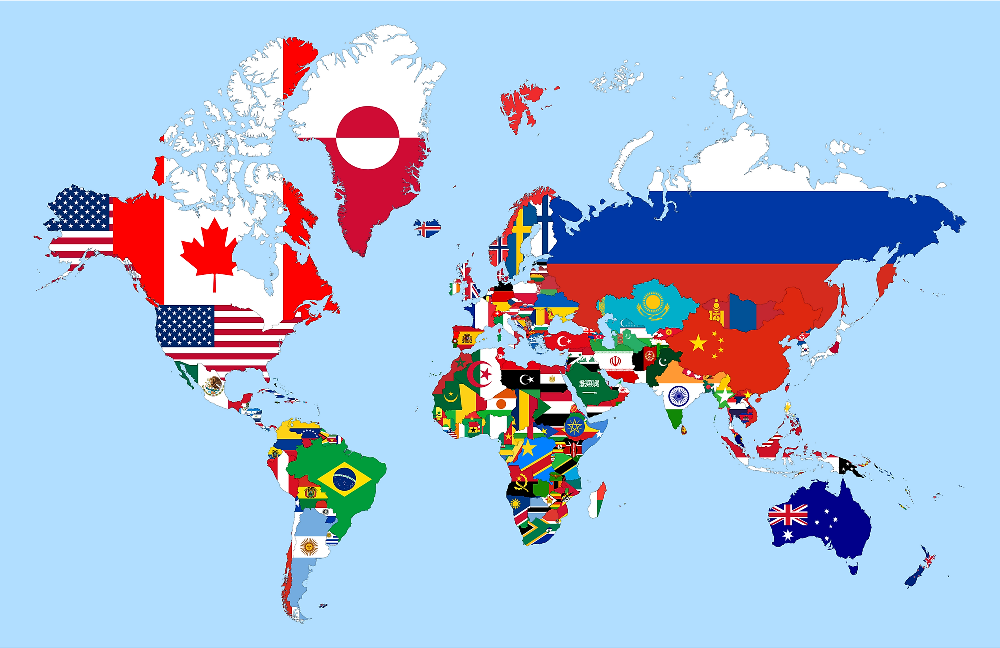

# Proyecto individual - Countries

  

## Bienvenidos a mi proyecto individual

Este proyecto fue desarrollado por mí durante la etapa de P.I. en Henry tras finalizar los 4 módulos del bootcamp de estudios.
Se planteó como objetivo principal afirmar y conectar los conceptos aprendidos hasta el momento. Además, se buscó implementar mejores prácticas.
Haciendo una vista rápida y general, podemos notar que la página contiene países de todo el mundo, información sobre los mismos y la posibilidad de, cual bitácora, agregarle actividades turísticas al país que se desee.
Se utilizaron distintas tecnologías para realizar el trabajo en su totalidad, desarrollando base de datos, back-end y front-end. 

## Tecnologías usadas

- [ ] React (Front-end)
- [ ] Redux (Front-end)
- [ ] Express (Back-end)
- [ ] Sequelize - Postgres (Base de datos)

### Base de datos

Cuenta con dos entidades: países y actividades. Como un país puede tener muchas actividades y una actividad puede pertenecer a muchos países, la relación entre ambas entidades es MUCHOS A MUCHOS, con lo cual utilizamos una tabla intermedia (en este caso, llamada country_activity). 
Se realizó una función loader para cargar la base de datos con información traída desde una API externa (https://restcountries.eu/). 
De esta manera, vamos a requerir solo una vez la información que esta API nos provee. De ahora en más, trabajamos con nuestra base de datos directamente.

### Back-end

Se desarrolló un servidor en Node/Express con los métodos GET y POST en diversas rutas. Las rutas utilizadas son:

- [ ] __GET /countries__: nos muestra un listado de todos los países. 
- [ ] __GET /countries/{idPais}__: nos muestra el detalle de un país en particular.
- [ ] __GET /countries?name="..."__: nos muestra los países que tengan coincidencias en su nombre con lo que iría en los puntos suspensivos (lo que se busca).
- [ ] __POST /activity__: recibe datos de las actividades desde un formulario y luego las crea en la base de datos

### Front-end

Se desarrolló una aplicación de React/Redux con: 

__Pagina inicial / Landing page__: posee la imagen característica del trabajo y un botón de ingreso.

__Ruta principal / Home__: donde se exhiben pequeñas tarjetas de países con un pequeño detalle de cada uno y con la posibilidad de hacer click (cada tarjeta es un link) para abrir el detalle más profundo de cada país. Se muestran 9 países y hay botones de flechas para avanzar y retroceder en el paginado de dichos países.
Sobre estas tarjetas se tiene una barra de navegación con ordenamientos (alfabéticamente y por población, tanto ascendente como descendentemente), filtrados (por continente) y barras de búsquedas (por nombre o por actividades), como así también con un botón de reset para volver a mostrar todos los países y un botón para acceder a la creación de una actividad turística.

## Espero que hayan disfrutado de mi proyecto!
